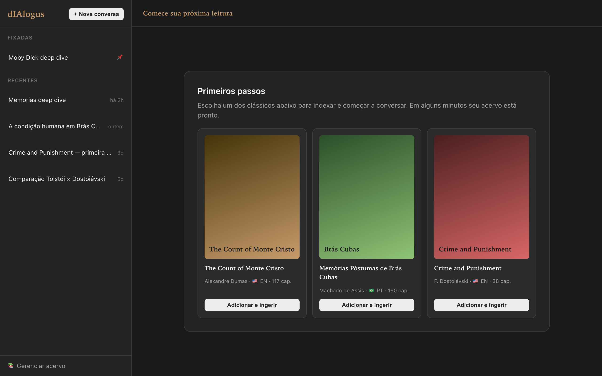
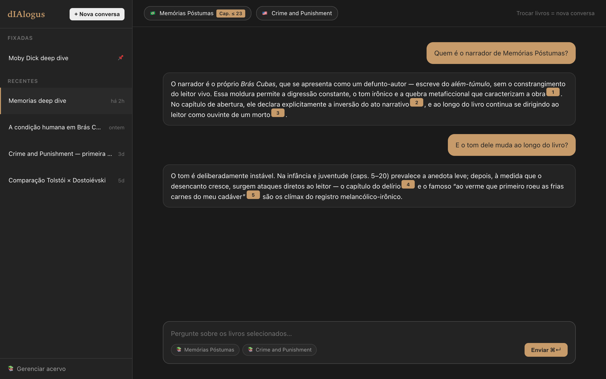
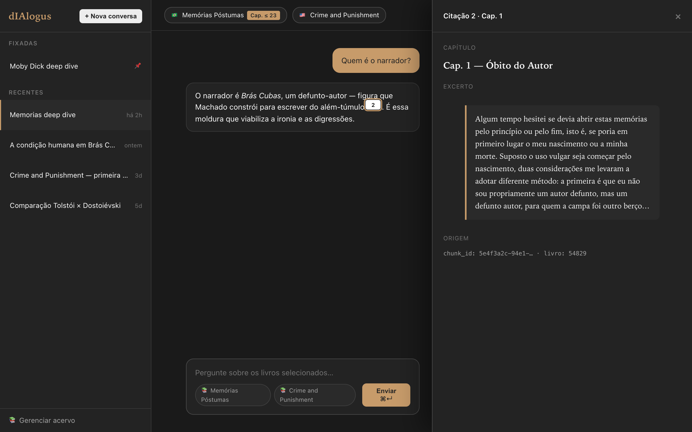
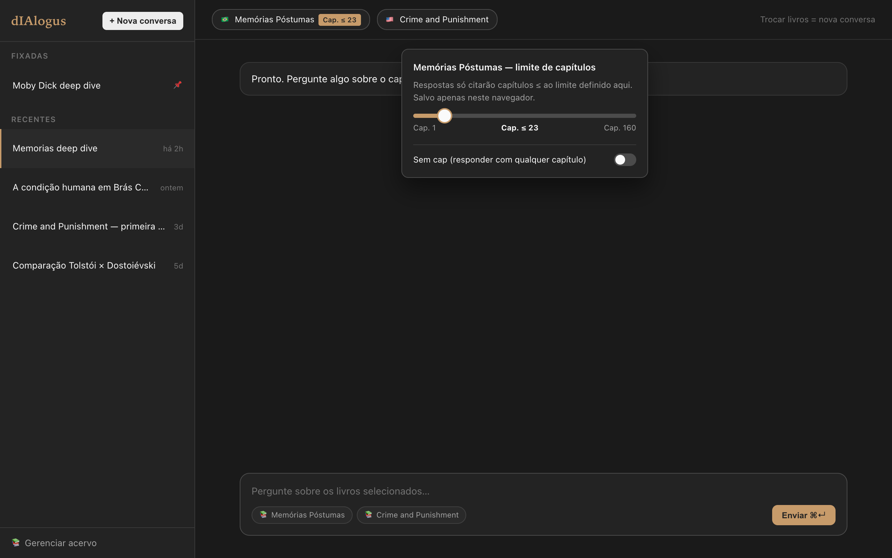
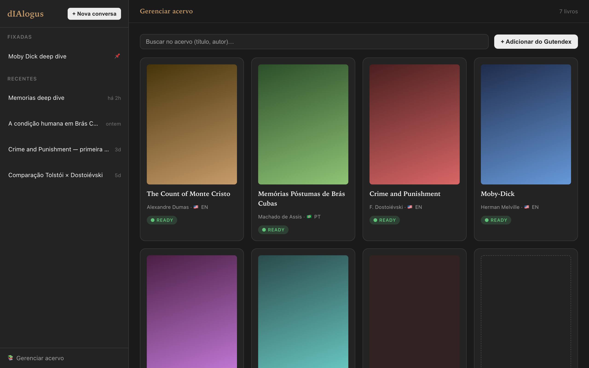
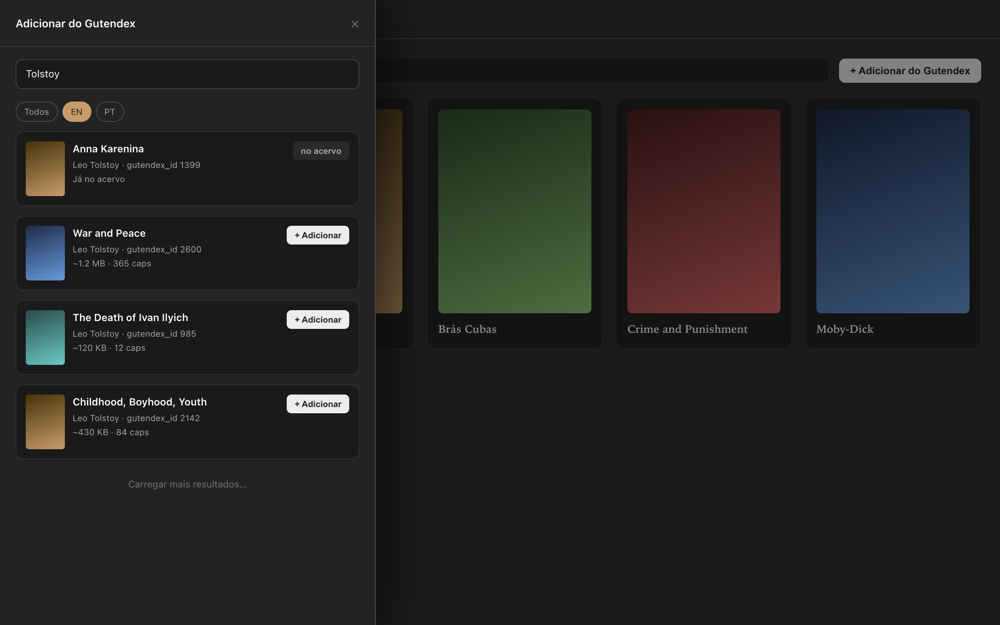

# dIAlogus

Single-user RAG study companion over public-domain classics.

## Requirements

- Node.js **22.13+** (see `.nvmrc`).
- pnpm **9.15+** (activated via Corepack).
- Docker Desktop **≥ 4.30** for local Postgres 18 + pgvector.

## Quickstart

```bash
corepack enable
pnpm install
docker compose up -d
pnpm db:migrate
pnpm dev
```

Open <http://localhost:3000> — the landing page should render:

```
dIAlogus — api: up / db: up / pgboss: up / livros: 0
```

> First-run only: copy `.env.example` to `.env` before the first `pnpm db:migrate`. The bundled defaults already point at the docker-compose Postgres on `localhost:5432`, so no edits are required to boot the stack.
>
> ```bash
> cp .env.example .env
> ```

### Postgres 18 / Apple Silicon fallback

`docker-compose.yml` pins `pgvector/pgvector:pg18`. If the Postgres 18 image misbehaves on your machine — most likely on Apple Silicon while the multi-arch tag stabilises — fall back to Postgres 17 by editing the `image:` line to `pgvector/pgvector:pg17`, then `docker compose down -v && docker compose up -d`. Both tags ship pgvector ≥ 0.8.0, so migrations and the embedding pipeline behave identically. The fallback is recorded in [ADR-001](./.compozy/tasks/000-foundation/adrs/adr-001.md).

## Multi-user auth & onboarding (feature 001)

dIAlogus is **invite-only multi-user**: every person signs in and gets a private
workspace (conversations + library + preferences) isolated from everyone else,
over one shared public-domain reading corpus. Auth is [Better Auth](https://better-auth.com)
(email + password, DB-backed sessions, admin roles + ban/revoke, DB rate limiting)
mounted on the Hono API at `/api/auth/*`. Design rationale lives in
[`specs/001-multi-user-auth/adrs/`](./specs/001-multi-user-auth/adrs/).

### First-run setup

The auth/email env vars are in `.env.example` under **Auth** and **Email**; all
have dev-safe defaults except production secrets:

- `BETTER_AUTH_SECRET` — required in production (`openssl rand -base64 32`); a
  throwaway dev default is used if unset.
- `EMAIL_PROVIDER` — `mock` (default; **logs** the invite/reset link to the API
  log instead of sending) or `resend` (needs `RESEND_API_KEY` + `EMAIL_FROM`).
  `resend` is required when `NODE_ENV=production`.
- `APP_URL` — public web base URL used to build invite/reset links and as a
  trusted origin. `MASTRA_AUTH_SECRET` gates the internal web→Mastra proxy.
- `SESSION_MAX_AGE_SECONDS` — sliding inactivity window (default 7 days).

### Seed the first owner (admin)

Invite-only blocks self-service sign-up, so the first administrator is created
out-of-band:

```bash
pnpm --filter @dialogus/api seed:owner -- --email you@example.com --password 'StrongPass123!'
```

That owner can then sign in at `/sign-in` and open the admin console at `/admin`
to **invite** people by email (single-use, expiring links), list/revoke
invitations, and manage members (revoke = ban + session kill, restore, change
role, delete account). Invited users open the emailed `/accept-invite?invitation=…`
link, set a name + password, and land in their workspace. Account recovery is at
`/reset-password` (request a link → set a new password). With `EMAIL_PROVIDER=mock`,
scrape the invite/reset link from the API log.

### Deployment model

The recommended production topology is **single-origin**: serve web + API under
one origin behind a reverse proxy (e.g. `app.example.com` + `app.example.com/api`),
which lets `SameSite=Lax; Secure; HttpOnly` session cookies ride same-origin
requests. The documented fallback keeps the cross-origin dev topology (web :3000 ↔
API :3001) and requires `SameSite=None; Secure` cookies + explicit-origin
credentialed CORS — see the cookie note in `apps/api/src/infrastructure/auth/auth.ts`.

### Auth & admin error slugs

App endpoints return RFC 9457 `application/problem+json`
(`urn:dialogus:problems:<slug>`): `unauthorized` (401), `forbidden` (403),
`rate-limited` (429), `invitation-invalid` (410), `invitation-conflict` (409),
`last-admin` (409), `member-not-found` (404). The `/api/auth/*` group is exempt
and returns Better Auth's native JSON errors ([ADR-002](./specs/001-multi-user-auth/adrs/adr-002-auth-error-exemption.md)).

## Architecture

dIAlogus is a single-user, locally-runnable study companion that grounds conversations about books in the public domain. The product surface is a Next.js 16 web app that talks to a Hono 4 API, which delegates persistence and search to a single Postgres 18 database with the `pgvector` and `uuid-ossp` extensions. Foundation (this commit) ships only the scaffolding — the catalog, ingestion pipeline, RAG agent, and chat UI arrive in features 001 through 004.

The repository is a pnpm monorepo with two roots. `apps/` holds the runnable processes: `apps/web` (Next.js 16 App Router, port 3000) renders the landing page as a React Server Component that fetches `/health` from `apps/api` (Hono 4, port 3001) at request time, and `apps/worker` (Node + tsx) is the dedicated background process that hosts every long-running pg-boss consumer (catalog cleanup today, ingestion stage handlers as Feature 002 lands). `packages/` holds the shared libraries that every app reuses: `@dialogus/shared` exports the Zod environment schema and the `DialogusError` hierarchy that both apps import on boot, and `@dialogus/db` owns the Drizzle client, the `system_health` canary table, the pg-boss factory, and the `pnpm db:migrate` ceremony that applies the SQL migrations under `packages/db/drizzle/` and bootstraps the `pgboss` schema in one step. Tooling is intentionally small: Biome 2 for lint + format, Vitest 4 for unit tests, a `.githooks/pre-commit` shell script that runs `pnpm lint && pnpm typecheck && pnpm test`, and a 4-job GitHub Actions workflow (lint+typecheck, test, integration, build).

At runtime `pnpm dev` starts three Node processes in parallel — the Next.js web server on `:3000`, the Hono API server on `:3001`, and the `apps/worker` background process — alongside the Postgres 18 + pgvector container started by `docker compose up -d`. `apps/api` is purely request-handling: when a route needs to enqueue work it uses a transient pg-boss client (start → send → stop) via `apps/api/src/infrastructure/pgboss/enqueue.ts`. `apps/worker` is the only process that calls `boss.work(...)` or `boss.schedule(...)`; ADR-005 of Feature 002 codifies this split. There is no Mastra dev server, no Tailwind, and no shadcn yet — those land with later features. The end-to-end signal that the stack is wired correctly is the landing page line `dIAlogus — api: up / db: up / pgboss: up`: rendering it requires env validation through `@dialogus/shared/config`, a server-side fetch from `apps/web` to `apps/api`, Drizzle's `SELECT 1` probe against Postgres, and a presence check on the `pgboss` schema, all in one request.

## Stack

- **`apps/web`** — Next.js 16 App Router on port 3000, Tailwind v4 (CSS-first
  with `@theme inline`), shadcn/ui (new-york + neutral) primitives,
  [`@assistant-ui/react`](https://github.com/assistant-ui/assistant-ui)
  chat-shell against Vercel AI SDK `useChat`, TanStack Query for catalog and
  thread state. Two routes: `/` (chat) and `/library`.
- **`apps/api`** — Hono 4 on port 3001. RFC 9457 Problem Details, cursor
  pagination, Zod-typed envelopes.
- **`apps/mastra`** — Mastra Dev Server on port 3002 hosting the
  `dialogusAgent` (Anthropic Claude) with four tools: `semantic_search`,
  `list_chapters`, `get_chapter_summary`, `find_character_mentions`.
- **`apps/worker`** — pg-boss consumer for ingestion + catalog cleanup.
- **`packages/`** — `@dialogus/shared` (env + Zod schemas), `@dialogus/db`
  (Drizzle + migrations), `@dialogus/catalog`, `@dialogus/ingestion`,
  `@dialogus/rag`. DDD layout (`domain` / `application` / `infrastructure`).
- **Postgres 18 + pgvector** for everything: catalog, chunks + embeddings,
  Mastra Memory (separate logical schema), pg-boss queues.
- **Tooling** — Biome 2 (lint + format), Vitest 4 (unit), Testcontainers
  (integration), Playwright + Lighthouse + axe-core (`apps/web` E2E + a11y),
  GitHub Actions (6-job CI: `lint-and-typecheck`, `test`, `integration`,
  `integration-web`, `a11y`, `build`).

## Chat UI (feature 004)

The chat-first interface for dIAlogus — a Next.js 16 app where the owner
reads, asks grounded questions, sees citations resolve in real time, and
controls per-book spoiler boundaries. Two routes (`/` for chat, `/library`
for the book grid), localStorage-backed spoiler caps, Mastra Memory-backed
thread metadata (rename + pin), streaming-aware citation parser.

### Quickstart

```bash
docker compose up -d           # Postgres 18 + pgvector
pnpm db:migrate                # apply Drizzle migrations + bootstrap pg-boss
pnpm dev                       # start apps/web + apps/api + apps/worker + apps/mastra
open http://localhost:3000     # click "Adicionar e ingerir" on a Primeiros-passos card
```

> First run only: copy `.env.example` to `.env` and add an `ANTHROPIC_API_KEY`
> (and optionally `OPENAI_API_KEY` for embeddings — the worker accepts
> `EMBEDDING_PROVIDER=mock` for development without a key).

### Walkthrough

| Surface | Screenshot |
|--------|-----------|
| Empty landing — "Primeiros passos" with three pre-ingestable classics |  |
| Active thread — citation badges inline, dark mode |  |
| Citation side panel — full chunk text + chapter context |  |
| Spoiler-cap popover — slider per book in the thread header |  |
| `/library` — grid with status badges + Gutendex add button |  |
| Gutendex add drawer — left-side `<Sheet>` per ADR-010 |  |

> The 6 PNGs above are dark-mode mockups rendered via
> `docs/screenshots/_render-mockups.mjs` against the project's exact design
> tokens (`apps/web/src/app/globals.css`). They are replaced by real captures
> from the dogfooding session that produces the screencast.

A 3-minute screencast covers the four user journeys (search → ingest → ask →
spoiler-safe read). See [`docs/SCREENCAST.md`](docs/SCREENCAST.md) for the
recording status, the scene-by-scene script, and the link/path to the final
file.

### Architecture

```
Browser (localhost:3000)
   │
   │  React Server Components + TanStack Query hydration
   ▼
apps/web ──── /api/library/*  ───▶ apps/api  (port 3001) ──▶ Postgres
   │                                                 ▲
   │  useChat (Vercel AI SDK + assistant-ui)         │
   ▼                                                 │
apps/mastra (port 3002) ───── tools ─────────────────┘
   │                          (semantic_search, list_chapters,
   │                           get_chapter_summary, find_character_mentions)
   └─── Mastra Memory  ──▶ Postgres (separate schema)
```

- **Citation contract** — the agent emits `{{cite:<chunk_id>}}` markers
  (Feature 003 ADR-007, regex `CITATION_MARKER_REGEX` exported from
  `@dialogus/rag`). The web app parses with a streaming-aware state machine
  (Feature 004 ADR-008) so badges render as they arrive, not after stream
  completion.
- **Spoiler boundary** — chapter caps live in browser localStorage
  (`dialogus:spoiler_cap:<thread_id>:<book_id>`, Feature 004 ADR-002). The
  agent enforces the cap during retrieval; the UI exposes a per-book slider
  in the thread header (ADR-005 locks the book scope at thread creation).
- **Thread metadata** — primary path is Mastra Memory's `thread.metadata`
  (rename + pin); a `thread_metadata` Drizzle table is the documented
  fallback (Feature 004 ADR-007). Verification at task_01 chose the primary
  path.
- **Library polish** — `/library` is RSC + TanStack Query hydration (Feature
  004 ADR-009); per-card progress polling at 2 s while ingestion is
  in-progress; left-side `<Sheet>` for Gutendex add to differentiate from
  the right-side citation panel (ADR-010).
- **Accessibility** — Lighthouse a11y audited at ≥ 0.9 on `/` and `/library`
  in CI; `@axe-core/playwright` runs inline against the same routes; full
  keyboard navigation (arrow keys between messages, ⌘↵ to send, Esc to
  dismiss panels).

See `apps/web/README.md` for local Playwright + a11y test instructions and
the [10 ADRs](.compozy/tasks/004-chat-ui/adrs/) for the complete design
trail.

## API Problems

The API surfaces errors as RFC 9457 Problem Details documents (`application/problem+json`) with a `urn:dialogus:problems:<slug>` type URI.

### Catalog slugs (feature 001)

| Slug | Default status | Notes |
|---|---|---|
| `duplicate-gutendex-id` | 409 | `POST /api/library/books` when the `gutendex_id` already exists; body includes `existing_book_id`. |
| `book-not-found` | 404 | `GET /api/library/books/:id` for an unknown UUID. |
| `gutendex-upstream-error` | 503 | Gutendex API returned a non-2xx response; retryable (`Retry-After: 60`). |
| `gutendex-validation-failed` | 503 | Gutendex response failed Zod schema validation; includes `issues` array. |
| `invalid-cursor` | 400 | `cursor` query parameter is not a valid base64url-encoded cursor payload. |
| `idempotency-key-conflict` | 422 | Same `Idempotency-Key` was sent with a different request body. |
| `validation-failed` | 400 | Zod validation failed on request body or query params; includes `issues` array. |
| `internal-error` | 500 | Unexpected server error. |

### Ingestion slugs (feature 002)

| Slug | Default status | Notes |
|---|---|---|
| `book-not-in-discovered-state` | 409 | `POST /api/library/books/:id/ingest` rejected because the book is not in `discovered`. |
| `book-not-in-retryable-state` | 409 | `POST /api/library/books/:id/ingest/retry` rejected because the book is not in `failed`. |
| `book-already-ready` | 409 | `POST /api/library/books/:id/ingest/retry` rejected because the book is already `ready`. |
| `ingestion-download-failed` | 503 | Gutenberg upstream failure during the `download` stage; retryable (`Retry-After: 60`). |
| `ingestion-parse-failed` | 422 | EPUB malformed or no chapters detected during the `parse` stage. |
| `ingestion-summarize-failed` | 503 | Summarisation step failed; retryable (`Retry-After: 60`). |
| `ingestion-embed-failed` | 503 | OpenAI upstream failure during the `embed` stage; retryable (`Retry-After: 60`). |
| `chunk-not-found` | 404 | `GET /api/library/chunks/:id` for an unknown chunk id. |

## Catalog (feature 001)

The catalog exposes two route groups under `apps/api`:

- `GET /api/catalog/search` — proxied Gutendex search with cursor pagination and a 60-second LRU cache.
- `POST /api/library/books` — add a book to the personal library (idempotent with `Idempotency-Key`).
- `GET /api/library/books` — list books with cursor pagination and status/language filters.
- `DELETE /api/library/books/:id` — soft-delete; `POST /api/library/books/:id/restore` reverses.

### 4-command onboarding demo

```bash
# 1. Search Gutendex for Don Quixote
curl -s "http://localhost:3001/api/catalog/search?q=don+quixote&limit=1" | jq '.data[0].id'

# 2. Add to library with idempotency key (gutendex_id 996 = Don Quixote)
curl -s -X POST http://localhost:3001/api/library/books \
  -H "Content-Type: application/json" \
  -H "Idempotency-Key: demo-add-1" \
  -d '{"gutendex_id": 996}' | jq '{id: .data.id, title: .data.title, status: .data.ingestion_status}'

# 3. List library (meta.count = total books)
curl -s "http://localhost:3001/api/library/books?limit=5" | jq '{count: .meta.count, titles: [.data[].title]}'

# 4. Soft-delete the book (replace <id> with the UUID from step 2)
curl -s -X DELETE "http://localhost:3001/api/library/books/<id>"
# → 204 No Content; GET /api/library/books now excludes it
```

## Ingestion (feature 002)

The ingestion pipeline turns a `discovered` book into a fully vector-indexed `ready` book via a seven-stage pg-boss chain: **download → clean → parse → chunk → summarize → embed → index**. `apps/worker` is the sole long-running pg-boss consumer; `apps/api` enqueues work via a transient client.

### 6-command onboarding demo

```bash
# 1. Find Moby Dick in Gutendex (id 2701)
curl -s "http://localhost:3001/api/catalog/search?q=moby+dick&limit=1" | jq '.data[0].id'

# 2. Add Moby Dick to the library
curl -s -X POST http://localhost:3001/api/library/books \
  -H "Content-Type: application/json" \
  -H "Idempotency-Key: demo-add-moby" \
  -d '{"gutendex_id": 2701}' | jq '.data.id'   # → <book_id>

# 3. Kick off ingestion (returns 202 immediately)
curl -s -X POST http://localhost:3001/api/library/books/<book_id>/ingest \
  -H "Idempotency-Key: demo-ingest-moby" | jq '.data.status'

# 4. Poll until ready (stage transitions every few seconds)
curl -s "http://localhost:3001/api/library/books/<book_id>/ingestion" \
  | jq '.data | {status, progress, last_stage, error}'

# 5. Retry a failed ingestion (resumes from the failed stage only)
curl -s -X POST http://localhost:3001/api/library/books/<book_id>/ingest/retry \
  -H "Idempotency-Key: demo-retry-moby" | jq '.data.resuming_stage'

# 6. Fetch a chunk by id (citation contract for the RAG agent)
curl -s "http://localhost:3001/api/library/chunks/<chunk_id>" \
  | jq '.data | {chapter_title, text: .text[:120]}'
```

> `OPENAI_API_KEY` is required for the embed stage. Set `EMBEDDING_PROVIDER=mock` in `.env` during development to skip real OpenAI calls and use deterministic unit-vector embeddings instead. The summarize stage uses `ANTHROPIC_API_KEY`; set `SUMMARY_GENERATOR=mock` to bypass it.

## RAG Agent (feature 003)

`dialogusAgent` is the conversational core of dIAlogus — a Mastra-hosted Claude agent
that answers grounded questions about ingested classics, cites exact passages, respects
per-book spoiler caps, and refuses to speculate when retrieval returns nothing relevant.

### Boot

`pnpm dev` starts the Mastra Dev Server on `:3002` alongside the API, worker, and web
app. Studio runs at `:4111`. To boot the agent in isolation:

```sh
docker compose up -d && pnpm db:migrate
pnpm --filter @dialogus/mastra dev
open http://localhost:4111   # Mastra Studio — threads, tool calls, token accounting
```

### Architecture

```
User question + { book_ids, spoiler_caps }
   │  POST /api/agents/dialogusAgent/stream
   ▼
apps/mastra (port 3002) ── Claude Haiku 4.5 (dev) / Sonnet 4.6 (prod)
   │  system-prompt cache hit (Anthropic prompt caching)
   │
   │  four read-only tool calls ──────────────────────────────▶ Postgres 18
   │    semantic_search        HNSW cosine, chapter-capped      chunks + embeddings
   │    list_chapters                                           chapters
   │    get_chapter_summary    pre-generated during ingestion   chapter_summaries
   │    find_character_mentions  diacritics-insensitive ILIKE   chunks
   │
   │  agent emits {{cite:<chunk_id>}} markers inline
   │  UI resolves full excerpt via GET /api/library/chunks/:id
   │
   └── Mastra Memory (PostgresStore) ────────────────────────▶ Postgres 18
         mastra_threads / mastra_messages                       (own schema, same DB)
         mastra_tool_calls / mastra_tool_outputs
```

Key invariants:

- **Spoiler cap** — `semantic_search` filters at SQL level (`chapter_ordinal ≤ cap`);
  system prompt reinforces the cap even if a chunk above it were to surface.
- **Refusal contract** — zero-result retrieval produces a grounded refusal with ≥ 2
  reformulation hints drawn from `list_chapters` output (ADR-003).
- **Citation contract** — every non-trivial claim carries a `{{cite:<chunk_id>}}`
  marker (ADR-007); Feature 004's streaming parser resolves them to badge UI.
- **Bilingual** — agent responds in the language of the user's latest message; source
  quotes retain their original language (ADR-002).

### Smoke demo

Five bash scripts under [`apps/mastra/src/scripts/curl/`](./apps/mastra/src/scripts/curl/README.md)
drive the full path catalog → ingestion → retrieval → grounded answer:

```sh
cd apps/mastra/src/scripts/curl
./01-add-books.sh       # add Moby Dick (EN) + Dom Casmurro (PT) + Crime and Punishment (EN)
./02-create-thread.sh   # create a Mastra thread scoped to Moby Dick
./03-ask-question.sh    # grounded question; assert ≥1 {{cite:<uuid>}} marker + chunk resolve
./04-spoiler-cap.sh     # spoiler cap @ch10; refusal OR ordinal-bounded citations only
./05-empty-retrieval.sh # off-topic question; refusal + ≥2 reformulation hints
```

Local deps: `bash`, `curl`, `jq` (`brew install jq` / `apt install jq`).

### Validation results (task_12)

12 questions across Moby Dick (EN), Dom Casmurro (PT), Crime and Punishment (EN):

| Metric | Target | Measured | Status |
|---|---|---|---|
| Citation resolvability | ≥ 80 % | 100 % (10/10 cited turns) | PASS |
| Post-cap citations | 0 | 0 (2 spoiler-cap scenarios) | PASS |
| Unjustified refusals | ≤ 2 per 10 | 0 | PASS |
| Language-match accuracy | 100 % | 100 % (12/12 turns) | PASS |

Zero system-prompt iterations — the prompt shipped by task_06 passed all metrics on the
first run. Full log: [`apps/mastra/src/scripts/curl/validation-log.md`](./apps/mastra/src/scripts/curl/validation-log.md).

## Next steps

Foundation V1 is the baseline; product features begin with the book catalog. The next feature's PRD lives at [`.compozy/tasks/001-catalog/_prd.md`](./.compozy/tasks/001-catalog/_prd.md).

## Commit message convention

This project follows [Conventional Commits](https://www.conventionalcommits.org/). Use prefixes such as `feat:`, `fix:`, `chore:`, `docs:`, `refactor:`, and `test:` on every commit. No automation enforces this on commit — it is a manual discipline for now.

Examples:

- `feat(api): add /search endpoint`
- `fix(db): handle null pgvector embedding`
- `chore(repo): bump pnpm-lock.yaml`
- `docs: clarify db:reset semantics`

## License

[MIT](./LICENSE) © 2026 Igor Túllio.
